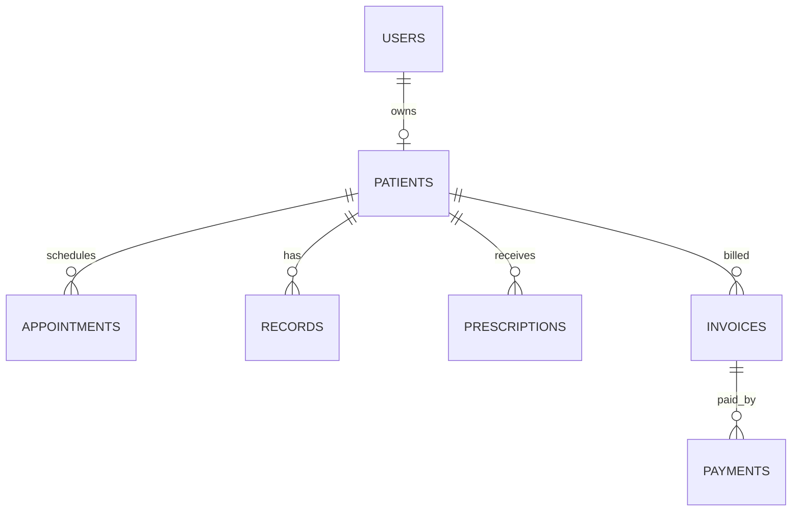

# MedFlow ERD

Core entities:

- users
- patients
- appointments
- records
- prescriptions
- invoices
- payments
- notifications

```mermaid
erDiagram
  USERS ||--o| PATIENTS : owns
  PATIENTS ||--o{ APPOINTMENTS : schedules
  PATIENTS ||--o{ RECORDS : has
  PATIENTS ||--o{ PRESCRIPTIONS : receives
  PATIENTS ||--o{ INVOICES : billed
  INVOICES ||--o{ PAYMENTS : paid_by
```

