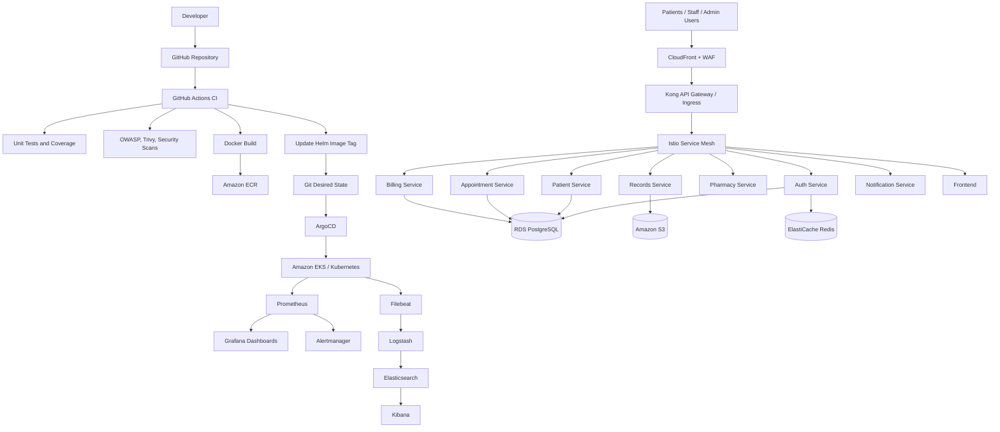

# MedFlow Interview Guide

## Project Introduction

MedFlow is a healthcare-focused DevSecOps microservices platform. The goal of the project is to demonstrate how a modern cloud-native application is developed, secured, deployed, monitored, and operated end to end.

The project includes application services, Docker containers, Kubernetes deployment manifests, Helm charts, Terraform infrastructure, CI/CD automation, GitOps deployment, security policies, monitoring, logging, disaster recovery scripts, and HIPAA-inspired compliance documentation.

In an interview, describe MedFlow like this:

> MedFlow is a healthcare DevSecOps platform that I built to demonstrate enterprise cloud-native delivery. It uses microservices for authentication, patient management, appointments, records, pharmacy, billing, notifications, and frontend access. The platform is containerized with Docker, deployed to Kubernetes on Amazon EKS, provisioned with Terraform, delivered through GitHub Actions and ArgoCD, and monitored using Prometheus, Grafana, Alertmanager, and the ELK stack. Since the domain is healthcare, I also focused on security, auditability, secrets management, network policies, pod security, and HIPAA-style operational controls.

## Architecture Diagram

## End-To-End Project Flow

1. A developer pushes code to GitHub.
2. GitHub Actions detects which service changed.
3. The pipeline installs dependencies and runs unit tests.
4. Security checks run, including dependency and container scanning.
5. Docker images are built for the changed services.
6. Images are pushed to Amazon ECR with immutable commit-based tags.
7. The pipeline updates the Helm values file with the new image tag.
8. The updated Helm values are committed back to Git.
9. ArgoCD watches the Git repository for desired-state changes.
10. ArgoCD syncs the Helm chart into the EKS cluster.
11. Kubernetes performs rolling deployments and checks pod readiness.
12. Traffic reaches the platform through CloudFront, WAF, Ingress, Kong, and Istio.
13. Services communicate internally through Kubernetes services and Istio.
14. PostgreSQL stores transactional data.
15. Redis supports caching and workflow coordination.
16. S3 stores medical record documents or object references.
17. Prometheus scrapes service and cluster metrics.
18. Grafana visualizes dashboards for platform, Kubernetes, services, and pipelines.
19. Alertmanager sends alerts when health or performance thresholds are crossed.
20. Filebeat ships container logs into Logstash, Elasticsearch, and Kibana.

## Main Components

| Component | Purpose |
|---|---|
| FastAPI services | Backend microservices for healthcare workflows |
| Docker | Containerizes each service |
| GitHub Actions | CI/CD automation |
| Amazon ECR | Stores container images |
| Terraform | Provisions AWS infrastructure |
| Amazon EKS | Runs Kubernetes workloads |
| Helm | Packages Kubernetes manifests |
| ArgoCD | GitOps deployment and reconciliation |
| Kong | API gateway and rate limiting |
| Istio | Service mesh, mTLS, retries, and traffic shifting |
| PostgreSQL / RDS | Transactional database |
| Redis / ElastiCache | Cache and workflow coordination |
| S3 | Document and object storage |
| Prometheus | Metrics collection |
| Grafana | Dashboards and visualization |
| Alertmanager | Alert routing |
| ELK | Centralized logging |
| External Secrets | Syncs AWS Secrets Manager values into Kubernetes |

## Service Responsibilities

| Service | Responsibility |
|---|---|
| Auth service | User registration, login, JWT issuing, roles |
| Patient service | Patient demographics and profile data |
| Appointment service | Appointment scheduling workflow |
| Records service | Medical record metadata and document references |
| Pharmacy service | Prescription workflow |
| Billing service | Invoices, payments, and claim-like records |
| Notification service | Email/SMS-style notifications |
| Frontend | Web interface for patients and staff |

## CI/CD Explanation

MedFlow uses GitHub Actions for CI/CD. The pipeline is designed to build only the services that changed. For each changed service, it runs tests, collects coverage, performs dependency checks, builds a Docker image, scans the image with Trivy, and pushes the image to Amazon ECR.

For deployment, the pipeline updates the Helm values file with the new image tag. This makes Git the source of truth. ArgoCD watches Git and reconciles the EKS cluster until the live Kubernetes state matches the desired state stored in the repository.

This model avoids manual deployment from a developer machine. Every deployment is traceable through Git commits, pipeline runs, image tags, and ArgoCD sync history.

## Security Explanation

Security is included throughout the project instead of being added only at the end.

- JWT authentication is used for user identity.
- RBAC-style claims support role-based access.
- GitHub Actions uses AWS OIDC instead of long-lived AWS keys.
- Container images are scanned before deployment.
- Kubernetes workloads use non-root containers and restricted security contexts.
- Network policies limit unnecessary pod-to-pod communication.
- External Secrets integrates Kubernetes with AWS Secrets Manager.
- Istio can enforce mTLS for internal service traffic.
- WAF and Kong provide edge and API gateway protection.
- HIPAA-style documentation describes encryption, audit logging, access control, and operational evidence.

## Observability Explanation

MedFlow uses both metrics and logs for observability.

Prometheus collects metrics from services and Kubernetes. Grafana dashboards show service health, Kubernetes cluster status, platform overview, and pipeline metrics. Alertmanager routes alerts when thresholds are crossed.

For logs, Filebeat runs as a Kubernetes DaemonSet and collects container logs. Logs flow through Logstash into Elasticsearch, and Kibana is used for searching and troubleshooting.

The key health signals are latency, traffic, errors, and saturation.

## Production Deployment Strategy

For production, the project supports safer deployment patterns through Istio. A new version can be deployed as the green environment while the old version continues serving traffic as blue. Traffic can be shifted gradually, for example 10 percent to green and 90 percent to blue. If error rates increase, traffic can be rolled back to blue. If the new version is healthy, traffic shifts fully to green.

## Honest Current Status

The most complete implemented application service is `auth-service`. It includes routes for health, readiness, metrics, registration, and login. Other services such as patient, appointment, billing, pharmacy, records, and notification are currently scaffolded and ready for further implementation.

The platform layer is the main strength of this project: Docker, Kubernetes, Helm, Terraform, CI/CD, GitOps, security policies, monitoring, logging, and operations documentation are present as an enterprise-style foundation.

In an interview, do not claim the entire healthcare product is fully finished. A strong answer is:

> The project is intentionally built as a DevSecOps platform foundation. The auth service is implemented more deeply, while the other services are scaffolded to show the intended service boundaries. My main focus was building the cloud-native delivery platform around the application: CI/CD, Kubernetes, GitOps, infrastructure as code, secrets, security, observability, and operational readiness.

## Short Interview Answer

MedFlow is a healthcare DevSecOps microservices project. I designed it to show how a real enterprise application would move from source code to production on AWS. Developers push code to GitHub, GitHub Actions tests and scans the code, Docker images are built and pushed to ECR, Helm values are updated, and ArgoCD deploys the desired state to EKS. Traffic is handled through CloudFront, WAF, Kong, and Istio. Services use PostgreSQL, Redis, and S3. Monitoring is handled with Prometheus, Grafana, and Alertmanager, while logs are centralized through Filebeat, Logstash, Elasticsearch, and Kibana. The project also includes security controls such as OIDC, Kubernetes policies, External Secrets, mTLS, and HIPAA-inspired compliance documentation.

## Key Interview Talking Points

- Explain why GitOps is useful: Git becomes the source of truth and ArgoCD prevents drift.
- Explain why OIDC is better than static AWS keys in CI/CD.
- Explain how Helm makes Kubernetes deployment reusable across environments.
- Explain why Prometheus metrics and ELK logs are both needed.
- Explain how Istio supports mTLS, retries, and blue-green traffic shifting.
- Explain why healthcare systems need audit logging, encryption, access control, and least privilege.
- Be clear that the project is a strong platform foundation, with `auth-service` implemented deeper than the other services.
